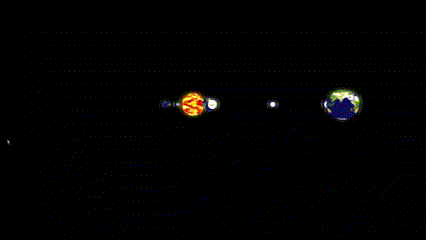
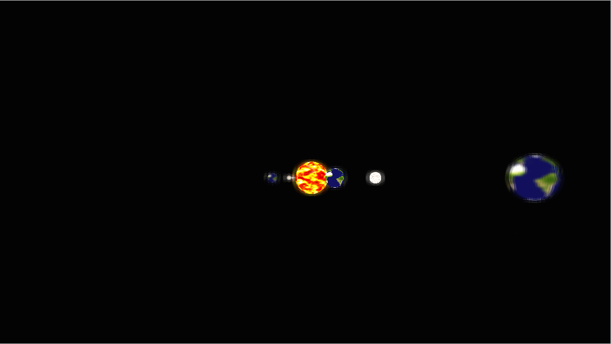
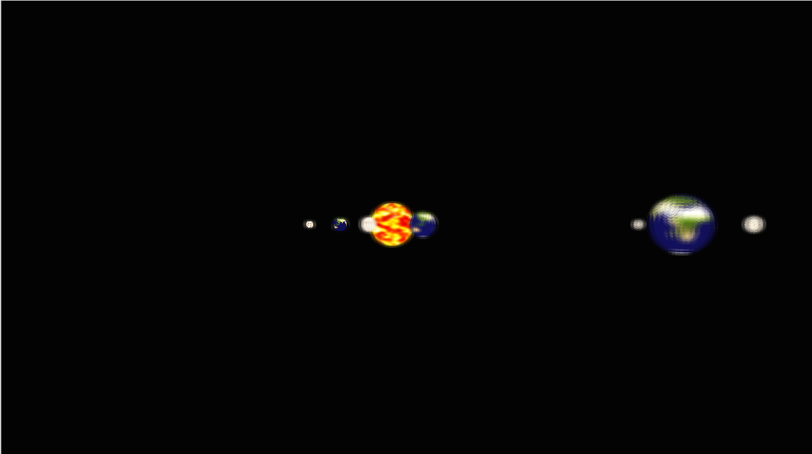
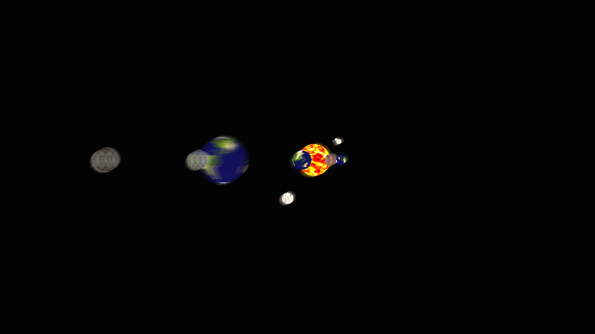
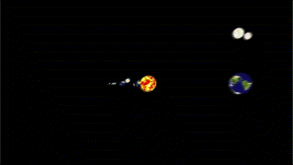
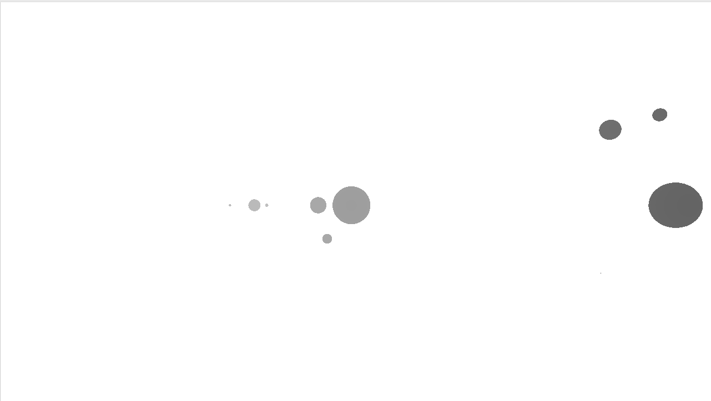

# Post Processing Galore

## [YouTube Link](https://youtu.be/Gfxqdv8ahRc)

## Setup

In order to run this project, simply go into the `part1` folder, and run 
```python3 build.py```
This will create an executable named `project`. To run it and see everything
working, simply run:
```./project```

Note: This project was testing and developed primarily for Linux, and might not
work on Mac or Windows. For windows it will work when using WSL.

## Helpful resources used to make this 
  * [This one was the best for motion blur](https://john-chapman-graphics.blogspot.com/2013/01/per-object-motion-blur.html)  
  * [Had to get deferred rendering up to pass the velocity and depth](https://learnopengl.com/Advanced-Lighting/Deferred-Shading)
  * [Helped me get an idea of what to do for depth of field](https://developer.nvidia.com/gpugems/gpugems/part-iv-image-processing/chapter-23-depth-field-survey-techniques)
  * [This helped a lot with depth of field](https://developer.nvidia.com/gpugems/gpugems/part-iv-image-processing/chapter-23-depth-field-survey-techniques)

## Media
### Depth of field 



  

### Motion Blur



### Visualizing the depth buffer


